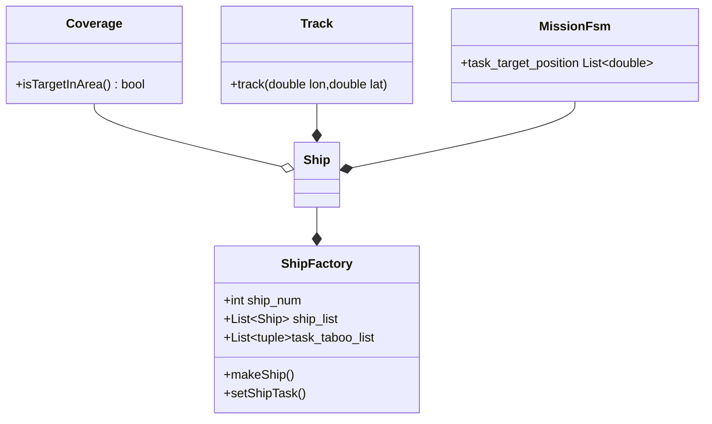

# 系统架构  

```mermaid

classDiagram
    
class ShipFactory
ShipFactory:+int ship_num
ShipFactory:+List~Ship~ ship_list
ShipFactory:+List~tuple~task_taboo_list
ShipFactory:+makeShip()
ShipFactory:+setShipTask()

class Ship


class Coverage
Coverage:+isTargetInArea() bool

class MissionFsm
MissionFsm:+task_target_position List~double~

class Track
Track:+track(double lon,double lat)


Coverage --o Ship
Track --* Ship
MissionFsm --* Ship
Ship --*  ShipFactory


```

```mermaid
classDiagram
class Game
GameBase <|-- Game
GameBase: -screen
GameBase: -running
GameBase: -
GameBase:
GameBase:
```